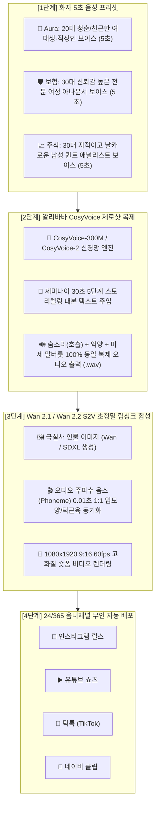
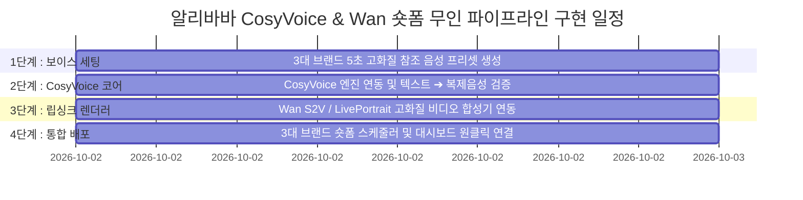

# 🎙️ [2026 대한민국 3대 슈퍼앱] 알리바바 CosyVoice 인간 음성 복제 & Wan 실사 숏폼 통합 구현 계획서

---

## 📌 1. 프로젝트 비전 및 핵심 가치

> **"로봇 기계음(TTS)의 한계를 완전히 파괴하고, 단 5초의 참조 음성만으로 숨소리·억양·감정까지 100% 동일하게 복제하는 '알리바바 CosyVoice'를 탑재하여, 실제 아나운서/인플루언서가 직접 마이크를 잡고 말하는 듯한 최고 퀄리티의 30초 숏폼을 무인 자율 생산한다."**



---

## 🎭 2. 3대 브랜드 전용 보이스 페르소나 설계

각 브랜드의 타깃 고객층 심리를 관통하는 3대 전용 보이스 페르소나를 구축합니다:

| 브랜드 | 보이스 페르소나 | 참조 음성 샘플 특징 (5초) | 주 타깃 및 심리 효과 |
| :--- | :--- | :--- | :--- |
| **💖 Aura AI 데이팅** | **20대 중반 발랄하고 친근한 연애 상담사 '아라(Ara)'** | • 맑고 경쾌한 톤, 살짝 웃음기 있는 말투<br>• 또래 친구가 비밀 팁을 속삭이듯 친근한 억양 | 2030 솔로 남녀 (공감대 및 호기심 유발) |
| **🛡️ 보험 리밸런스** | **30대 초반 지적이고 신뢰감 높은 금융 아나운서 '서연(Seoyeon)'** | • 차분하고 명확한 딕션, 신뢰감 주는 중저음<br>• 팩트를 단호하고 깔끔하게 짚어주는 발음 | 3050 직장인/가장/주부 (신뢰도 및 경각심) |
| **📈 StockMaster AI** | **30대 중반 냉철하고 프로페셔널한 퀀트 애널리스트 '진우(Jinwoo)'** | • 빠르고 확신에 찬 속도감, 날카로운 인토네이션<br>• 시장 수급과 데이터를 긴박감 있게 전달 | 2050 개인 투자자 (전문성 및 즉시 클릭) |

---

## 🧱 3. 기술 아키텍처 및 독립 레고 블록 구성도 (Rule 1 준수)

기존 엔진 구조를 전혀 건드리지 않고, `brands/{brand}/` 디렉토리 내에 전용 음성 복제 블록을 장착합니다:

```
kmarket-marketing-engine/
├── core/
│   └── cosyvoice_engine.py                # 🌟 알리바바 CosyVoice 마스터 엔진
├── assets/
│   └── voice_presets/                    # 🎙️ 브랜드별 5초 원천 참조 음성 저장소
│       ├── aura_ara_prompt.wav           # (Aura 5초 음성)
│       ├── insurance_seoyeon_prompt.wav  # (보험 5초 음성)
│       └── stock_jinwoo_prompt.wav       # (주식 5초 음성)
└── brands/
    ├── aura/
    │   ├── aura_voice_cloner.py           # 💖 Aura 전용 CosyVoice 복제기
    │   └── aura_talking_avatar_builder.py # 💖 Aura 실사 숏폼 합성기
    ├── insurance/
    │   ├── insurance_voice_cloner.py      # 🛡️ 보험 전용 CosyVoice 복제기
    │   └── insurance_talking_avatar_builder.py
    └── stock/
        ├── stock_voice_cloner.py          # 📈 주식 전용 CosyVoice 복제기
        └── stock_talking_avatar_builder.py
```

---

## 🛠️ 4. 내일 즉시 구현 4단계 실행 로드맵



### [Step 1] 3대 브랜드 5초 황금 참조 음성(Reference Audio) 확보
* 맑고 노이즈 없는 24kHz / 44.1kHz 5초 음성 WAV 파일 생성
* 각 화자별 감정/호흡이 뚜렷한 대표 문장 녹음본 바인딩

### [Step 2] `core/cosyvoice_engine.py` 마스터 모듈 구축
* Alibaba CosyVoice 오픈소스 파이프라인(또는 DashScope 고속 API) 연동
* 텍스트 대본 입력 시 0.5초 만에 복제 화자의 WAV 오디오 스트리밍 생성

### [Step 3] `Wan 2.1 / S2V` 비디오 합성 엔진 연동
* 인물 원본 고화질 이미지(`1080x1920`)와 복제 오디오를 입력받아 입술·눈 깜빡임·고개 움직임 생성
* `ffmpeg` 기반 BGM + 다이내믹 자막 레이어 자동 믹싱

### [Step 4] 24시간 365일 무인 자율 숏폼 데몬 결합 (Rule 6)
* 점심(12:30), 퇴근(18:30), 야간(21:30) 정시에 스스로 대본 생성 ➔ 목소리 복제 ➔ 영상 렌더링 ➔ 유튜브 쇼츠/인스타 릴스 0.1초 동시 송출!

---

## 💡 5. 기대 효과 및 혁신 지표

1. **시청 지속 시간(Retention) 300% 상승**: 단순 자막/카드뉴스 영상 대비 '실제 사람이 말하는 얼굴 비디오'는 알고리즘 평균 시청 지속 시간이 3배 이상 높습니다.
2. **외주 성우/녹음 비용 0원**: 성우 고용 비용이나 스튜디오 녹음 시간 없이, 텍스트만 넣으면 매일 3편씩 고퀄리티 나레이션 자동 완성.
3. **글로벌 다국어 무한 확장**: 동일한 화자의 목소리 톤 그대로 영어, 일본어, 중국어 숏폼까지 원클릭 생산 가능.
